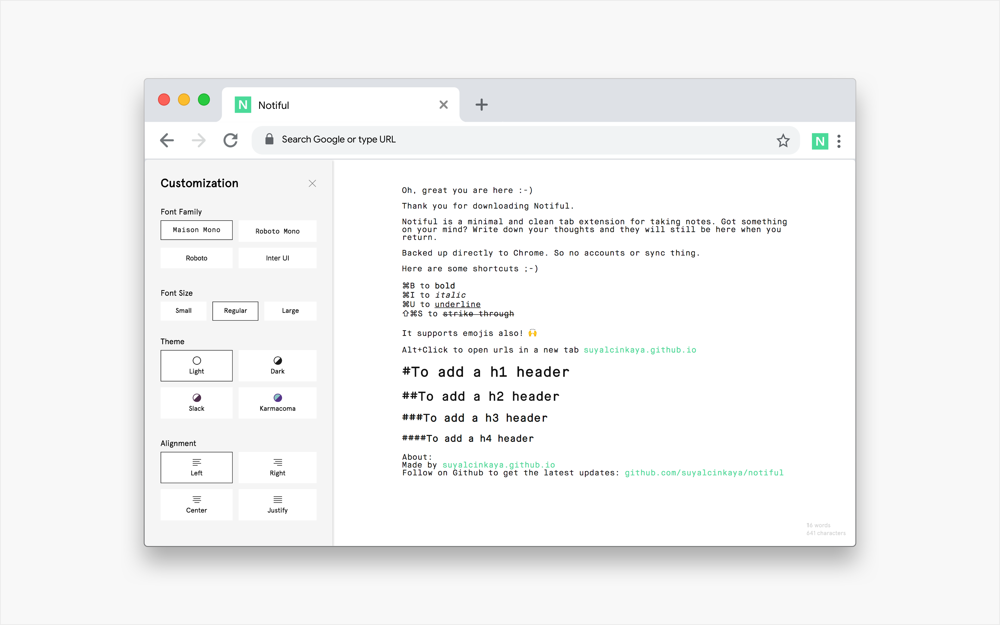

# Notiful

An open source minimal and clean taking notes extension for Chrome

## Contributing

Bug reports, feature requests and pull requests are always welcome.

## License

Notiful is licensed under the [MIT License](https://github.com/suyalcinkaya/notiful/blob/master/LICENSE).
